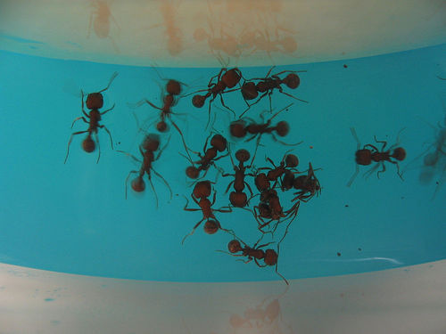
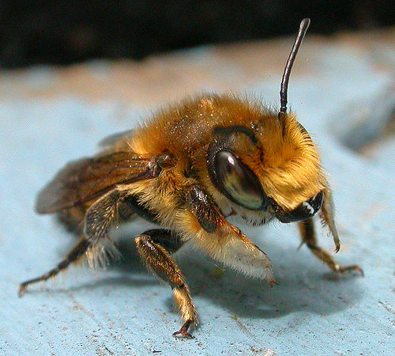
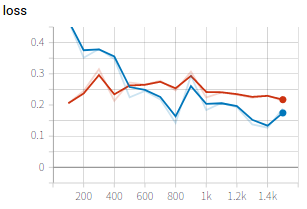
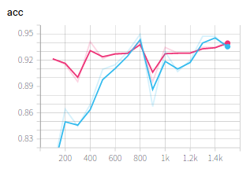

# Toy example of image classification




In this example, we finetune a pretrained resnet18 for classification of images with two categries: Ant and Bee. This example is a PyMIC implementation of pytorch's "transfer learning for computer vision tutorial". The orginal tutorial can be found [here][torch_tutorial]. In PyMIC's implementation, we only need to edit the configure file to run the code. 

## Data and preprocessing
1. The dataset contains about 120 training images each for ants and bees. There are 75 validation images for each class. Download the data from [here][data_link] and extract it.
2. Set `AntBee_root` according to your computer in `write_csv_files.py`, where `AntBee_root` should be the path of `hymenoptera_data` based on the dataset you extracted. 
3. Run `python write_csv_files.py` to create two csv files storing the paths and labels of training and validation images. They are `train_data.csv` and `valid_data.csv` and saved in `./config`.

[torch_tutorial]:https://pytorch.org/tutorials/beginner/transfer_learning_tutorial.html
[data_link]:https://download.pytorch.org/tutorial/hymenoptera_data.zip

## Finetuning all layers of resnet18
1. Here we use resnet18 for finetuning, and update all the layers. Open the configure file `config/train_test_ce1.cfg`. In  the `network` section we can find details for the network. In the `dataset` section, set the value of `root_dir` as your `AntBee_root`. Then start to train by running:
 
```bash
pymic_net_run_cls train config/train_test_ce1.cfg
```

2. During training or after training, run `tensorboard --logdir model/resnet18_ce1` and you will see a link in the output, such as `http://your-computer:6006`. Open the link in the browser and you can observe the average loss and accuracy during the training stage, such as shown in the following images, where blue and red curves are for training set and validation set respectively. The iteration number obtained the highest accuracy on the validation set was 400, and may be different based on the hardware environment. After training, you can find the trained models in `./model/resnet18_ce1`. 




## Testing and evaluation
1. Run the following command to obtain classification results of testing images. By default we use the best performing checkpoint based on the validation set. You can set `ckpt_mode` to 0 in `config/train_test.cfg` to use the latest checkpoint.


```bash
mkdir result
pymic_net_run_cls test config/train_test_ce1.cfg
```

2. Then run the following command to obtain quantitative evaluation results in terms of accuracy. 

```bash
pymic_evaluate_cls config/evaluation.cfg
```

The obtained accuracy by default setting should be around 0.9412, and the AUC will be 0.973.

## Finetuning the last layer of resnet18
Similarly to the above example, we further try to only finetune the last layer of resnet18 for the same classification task. Use a different configure file `config/train_test_ce2.cfg` for training and testing, where `update_layers = -1` in the `network` section means updating the last layer only. Edit `config/evaluation.cfg` accordinly for evaluation. The iteration number obtained the highest accuracy on the validation set was 400, and the accuracy will be around 0.9543. The AUC will be 0.981
