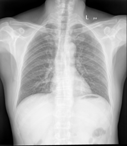
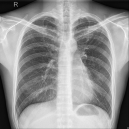
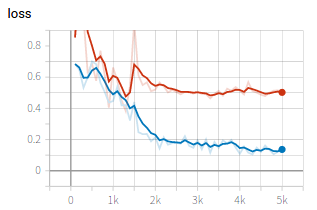
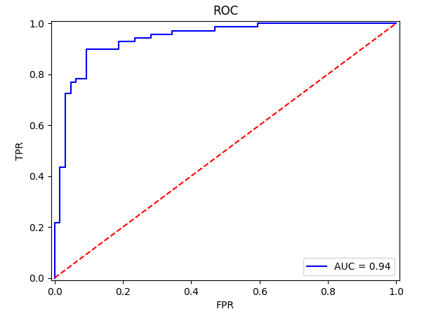

# Example of Tuberculosis X-Ray Image Classification




In this example, we finetune pretrained resnet18, vgg16 and vitb16 for classification of X-Ray images with two categries: normal and tuberculosis. 

## Data and preprocessing
1. We use the Shenzhen Hospital X-ray Set for this experiment. This [dataset] contains images in JPEG format. There are 326 normal x-rays and 336 abnormal x-rays showing various manifestations of tuberculosis. The images are available in `PyMIC_data/CHNCXR`.

[data_link]:https://lhncbc.nlm.nih.gov/publication/pub9931

2. Run `python write_csv_files.py` to randomly split the entire dataset into 70% for training, 10% for validation and 20% for testing. The output files are `cxr_train.csv`, `cxr_valid.csv` and `cxr_test.csv` under folder `./config`.

## Finetuning resnet18
1. First, we use resnet18 for finetuning, and update all the layers. The configuration file is `config/net_resnet18.cfg`. The setting for network is:

```bash
net_type = resnet18
pretrain = True
input_chns = 3
# finetune all the layers
update_mode = all
```

Start to train by running:
 
```bash
pymic_train config/net_resnet18.cfg
```

2. During training or after training, run `tensorboard --logdir model/resnet18` and you will see a link in the output, such as `http://your-computer:6006`. Open the link in the browser and you can observe the average loss and accuracy during the training stage, such as shown in the following images, where blue and red curves are for training set and validation set respectively. The iteration number obtained the highest accuracy on the validation set was 1800, and may be different based on the hardware environment. After training, you can find the trained models in `./model/resnet18`. 




## Testing and evaluation
1. Run the following command to obtain classification results of testing images. By default we use the best performing checkpoint based on the validation set. You can set `ckpt_mode` to 0 in `config/train_test.cfg` to use the latest checkpoint.

```bash
mkdir result
pymic_test config/net_resnet18.cfg
```

2. Then run the following command to obtain quantitative evaluation results in terms of accuracy. 

```bash
pymic_eval_cls -cfg config/evaluation.cfg
```

The obtained accuracy by default setting should be around 0.8271, and the AUC is 0.9343.

3. Run `python show_roc.py` to show the receiver operating characteristic curve. 




## Finetuning VGG16
Similarly to the above example, we further try to finetune vgg16 for the same classification task. Use a different configure file `config/net_vgg16.cfg` for training and testing. Edit `config/evaluation.cfg` accordinly for evaluation. The accuracy and AUC would be around 0.8571 and 0.9271, respectively. 

## Finetuning ViTB16
Just follow the above steps with the configuration file `config/net_vitb16.cfg` for training and testing.

