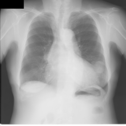
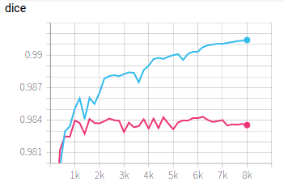
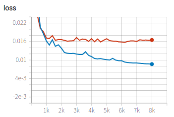

# Lung segmentation from 2D X-ray images




In this example, we use different 2D networks to segment the lung from X-Ray images. First we edit the configuration file for training and testing. During training, we use tensorboard to observe the performance of the network at different iterations. We then apply the trained model to testing images and obtain quantitative evaluation results. The following networks are implemented in this example:

|Network  |Reference | Remarks|
|---|---| ---|
|UNet2D | [Ronneberger et al., MICCAI 2015][unet_paper]|  2D Unet|
|UNet2D_ScSE |[Roy et al., TMI 2019][scse_paper]| 2D UNe with spatial and channel attention |
|CANet| [Gu et al., TMI 2021][canet_paper]| Comprehensive Attentin Network|
|COPLENet | [Wang et al., TMI 2020][coplenet]| Originally for Covid-19 lesion segmentation|
|UNet++ | [Zhou et al., MICCAI Workshop 2018][unet++]| Nested 2D UNet |
|TransUNet | [Chen et al., Arxiv 2021][transunet]|  UNet combined with Transformer |
|SwinUNet|  [Cao et al., ECCV Workshop 2022][swinunet]| UNet combined with Swin Transformer |

[unet_paper]:https://link.springer.com/chapter/10.1007/978-3-319-24574-4_28
[scse_paper]:https://ieeexplore.ieee.org/document/8447284
[canet_paper]:https://ieeexplore.ieee.org/abstract/document/9246575
[coplenet]:https://ieeexplore.ieee.org/document/9109297
[unet++]:https://link.springer.com/chapter/10.1007/978-3-030-00889-5_1
[transunet]:https://arxiv.org/abs/2102.04306
[swinunet]:https://link.springer.com/chapter/10.1007/978-3-031-25066-8_9

## 1. Data and preprocessing

1. The orginal dataset is available at the [JSRT website][jsrt_link]. It consists of 247 chest radiographs. We have preprocessed the images by resizing them to 256x256 and extracting the lung masks for the segmentation task. The images are available at `PyMIC_data/JSRT`. If interested, you can read `image_convert.py` for details of the preprocessing.  

2. Run `python write_csv_files.py` to randomly split the 247 images into training (180 images), validation (20 images) and testing (47 images) sets. The output csv files are saved in `config`.

[jsrt_link]:http://db.jsrt.or.jp/eng.php

## 2. Training and testing with COPLENet

1. We first use COPLENet for the segmentation task. The configuration file `config/coplenet.cfg` looks like: 

```bash
[dataset]
...
train_dir = ../../PyMIC_data/JSRT
train_csv = config/jsrt_train.csv
valid_csv = config/jsrt_valid.csv
test_csv  = config/jsrt_test.csv

train_batch_size = 4
train_transform  = [NormalizeWithMeanStd, RandomCrop, LabelConvert, LabelToProbability]
valid_transform  = [NormalizeWithMeanStd, LabelConvert, LabelToProbability]
test_transform   = [NormalizeWithMeanStd]

NormalizeWithMeanStd_channels = [0]
RandomCrop_output_size        = [224, 224]
LabelConvert_source_list = [0, 255]
LabelConvert_target_list = [0, 1]

[network]
net_type = COPLENet
class_num     = 2
in_chns       = 1
feature_chns  = [16, 32, 64, 128, 256]
dropout       = [0,  0,  0.3, 0.4, 0.5]

[training]
...
loss_type     = DiceLoss
optimizer     = Adam
learning_rate = 1e-3
momentum      = 0.9
weight_decay  = 1e-5

lr_scheduler  = MultiStepLR
lr_gamma      = 0.5
lr_milestones = [1500, 3000, 4500]

ckpt_dir   = model/coplenet
iter_max   = 6000
iter_valid = 250
iter_save  = 6000
```

where we use random crop for data augmentation. The original labels are 0 and 255, and they are converted to 0 and 1, respectively.  Each batch contains 4 images, with a patch size of 224x224. The DiceLoss is used for training, with an Adam optimizer and an initial learning rate of 0.001. The total iteration number is 6000, and the MultiStep learning rate scheduler is used.  Start to train by running:

 
```bash
pymic_train config/coplenet.cfg
```

During training or after training, run `tensorboard --logdir model/coplenet` and you will see a link in the output, such as `http://your-computer:6006`. Open the link in the browser and you can observe the average Dice score and loss during the training stage, such as shown in the following images. , where red and blue curves are for training set and validation set respectively. In the left one, the yellow and purple curves are for training and validation Dice,  respectively.  In the right one, the cyan and red curves are for training and validation loss,  respectively. 





2. The configuration for testing is in `[testing]` section of `config/coplenet.cfg`:

```bash
[testing]
gpus       = [0]

# checkpoint mode can be [0-latest, 1-best, 2-specified]
ckpt_mode         = 1
output_dir        = result/coplenet

sliding_window_enable  = True
sliding_window_size    = [224, 224]
sliding_window_stride  = [224, 224]

# convert the label of prediction output
label_source = [0, 1]
label_target = [0, 255]
```

where we use a sliding window of 224x224 for inference, and the prediction label is coverted from {0,1} to {0, 255}. By default we use the best validation checkpoint for inference. Run the following command for testing:

```bash
pymic_test config/coplenet.cfg
```

3. Use the following command to obtain quantitative evaluation results in terms of Dice. 

```bash
pymic_eval_seg -cfg config/evaluation.cfg
```

The obtained average Dice score by default setting should be close to 98.04%. The Average Symmetric Surface Distance (ASSD) is also calculated. 


## 3. Training and testing with other networks

For the other networks, please replace `config/coplenet.cfg` by the corresponding configuration files during the training and prediction stages. See `config/***.cfg` for examples of other networks, such as UNet, CANet, UNet++, TransUNet and SwinUNet.

