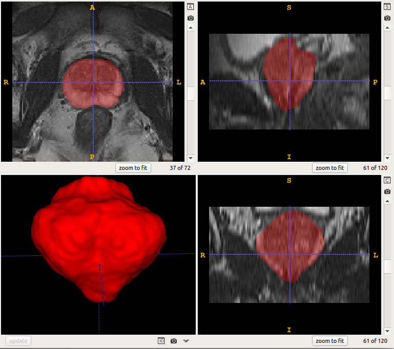
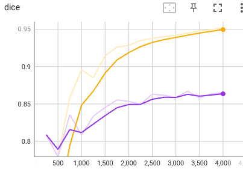

# Prostate segmentation from 3D MRI
 

In this example, we use 3D neural networks to to segment the prostate from 3D MRI. 
The following networks are considered:

|Network  |Reference | Remarks|
|---|---| ---|
|UNet2D5 | [Wang et al., MICCAI 2019][unet2d5_paper]|  A 2.5D UNet combining 2D and 3D convolutions|
|UNet3D |[Çiçek et al., MICCAI 2016][unet3d_paper]| 3D UNet|
|UNet3D_scse |[Roy et al., TMI 2019][scse_paper]| 3D UNe with spatial and channel attention |
|LCOVNet| [Zhao et al., TMI 2023][lcovnet_paper]| A lightweight 3D CNN|

[unet2d5_paper]:https://link.springer.com/chapter/10.1007/978-3-030-32245-8_30
[unet3d_paper]:https://link.springer.com/chapter/10.1007/978-3-319-46723-8_49
[scse_paper]:https://ieeexplore.ieee.org/document/8447284
[lcovnet_paper]:https://ieeexplore.ieee.org/document/10083150/

## 1. Data 
We use the [Promise12][promise12_link] dataset for this example. The preprocessed images are available in `PyMIC_examples/PyMIC_data/Promise12`. We have resampled the original images into a uniform resolution and cropped them to a smaller size. The code for preprocessing is in  `preprocess.py`.

Run `python write_csv_files.py` to randomly split the dataset into our own training (35 images), validation (5 images) and testing (10 images) sets. The output csv files are saved in `config/data`.

[promise12_link]:https://promise12.grand-challenge.org/

## 2. Segmentation using UNet3D
### 2.1 Training
We first use the UNet3D for the segmentation task. The configuration file is `config/unet3d.cfg`. Some key configurations are like the following:

```bash
[dataset]
...
train_dir = ../../PyMIC_data/Promise12/preprocess
train_csv = config/data/image_train.csv
valid_csv = config/data/image_valid.csv
test_csv  = config/data/image_test.csv

train_batch_size = 4
patch_size = [96, 96, 96]

train_transform = [Pad, RandomCrop, RandomFlip, NormalizeWithMeanStd, GammaCorrection, GaussianNoise, LabelToProbability]
valid_transform = [NormalizeWithMeanStd, Pad, LabelToProbability]
test_transform  = [NormalizeWithMeanStd, Pad]
...

[network]
net_type = UNet3D

class_num     = 2
in_chns       = 1
feature_chns  = [16, 32, 64, 128, 256]
dropout       = [0.0, 0.0, 0.2, 0.2, 0.2]
multiscale_pred = True

[training]
gpus          = [0]
loss_type     = [DiceLoss, CrossEntropyLoss]
loss_weight   = [1.0, 1.0]
deep_supervise = True

optimizer     = Adam
learning_rate = 1e-3
momentum      = 0.9
weight_decay  = 1e-5

lr_scheduler  = StepLR
lr_gamma      = 0.5
lr_step       = 2000
early_stop_patience = 1000
ckpt_dir    = model/unet3d

iter_max   = 6000
iter_valid = 250
iter_save  = 6000
...
```

where we use random crop, flipping, GammaCorrection and GaussianNoise for data augmentation. Each batch contains 4 images, with a patch size of 96x96x96. The DiceLoss and CrossEntropyLoss are used for training. The network has prdictions at multiple resolution levels due to `multiscale_pred = True`, and deep supervision is used by setting `deep_supervise = True`. The Adam optimizer is used for training, with an initial learning rate of 0.001. The total iteration number is 6000, and the Step learning rate scheduler is used.  Start to train by running:
 

During training or after training, run `tensorboard --logdir model/unet3d` and you will see a link in the output, such as `http://your-computer:6006`. Open the link in the browser and you can observe the average Dice score and loss during the training stage, such as shown in the following images, where blue and red curves are for training set and validation set respectively. 




### 2.2 Testing 
The configuration for testing is in `[testing]` section of `config/unet3d.cfg`:

```bash
[testing]
gpus          = [0]
ckpt_mode     = 1
output_dir    = result/unet3d
post_process  = KeepLargestComponent

sliding_window_enable = True
sliding_window_size   = [96, 96, 96]
sliding_window_stride = [96, 96, 96]
```

where we use a sliding window of 96x96x96 for inference. By default we use the best validation checkpoint for inference, and the segmentation results are post-processed by keeping the largest component of each volume by setting `post_process  = KeepLargestComponent`. Run the following command for testing:

```bash
pymic_test config/unet3d.cfg
```

### 2.3 Evaluation
2. Run the following command to obtain quantitative evaluation results in terms of Dice. 

```bash
pymic_eval_seg -cfg config/evaluation.cfg
```

The obtained average Dice score by default setting should be close to 88.04%, and the Average Symmetric Surface Distance (ASSD) is 1.41 mm. You can try your efforts to improve the performance with different networks or training strategies by changing the configuration file `config/unet3d.cfg`.

