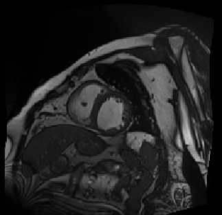
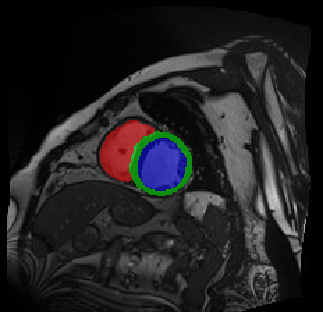
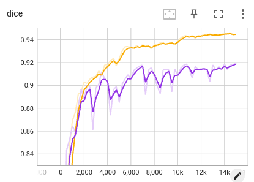
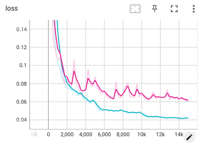

# Heart Structure Segmentation using 2D Networks
  

In this example, we show heart structure segmentaiton from the ACDC dataset using the following 2D networks:

|Network  |Reference |
|---|---|
|UNet2D | [Ronneberger et al., MICCAI 2015][unet_paper]| 
|UNet2D_scse |[Roy et al., TMI 2019][scse_paper]|
|CANet| [Gu et al., TMI 2021][canet_paper]|
|COPLENet | [Wang et al., TMI 2020][coplenet]|
|UNet++ | [Zhou et al., MICCAI Workshop 2018][unet++]|
|TransUNet | [Chen et al., Arxiv 2021][transunet]| 
|SwinUNet|  [Cao et al., ECCV Workshop 2022][swinunet]|

[unet_paper]:https://link.springer.com/chapter/10.1007/978-3-319-24574-4_28
[scse_paper]:https://ieeexplore.ieee.org/document/8447284
[canet_paper]:https://ieeexplore.ieee.org/abstract/document/9246575
[coplenet]:https://ieeexplore.ieee.org/document/9109297
[unet++]:https://link.springer.com/chapter/10.1007/978-3-030-00889-5_1
[transunet]:https://arxiv.org/abs/2102.04306
[swinunet]:https://link.springer.com/chapter/10.1007/978-3-031-25066-8_9


## 1. Data 
The [ACDC][ACDC_link] (Automatic Cardiac Diagnosis Challenge) dataset is used in this demo. It contains 200 short-axis cardiac cine MR images of 100 patients, and the classes for segmentation are: Right Ventricle (RV), Myocardiym (Myo) and Left Ventricle (LV). The images are available in `PyMIC_data/ACDC/preprocess`, where we have normalized the intensity to [0, 1]. The images are split at patient level into 70%, 10% and 20% for training, validation  and testing, respectively (see `config/data` for details).

[ACDC_link]:https://www.creatis.insa-lyon.fr/Challenge/acdc/databases.html

## 2. Demo with 2D UNet
1. The configuration file for training with  UNet is `config/unet.cfg`. It looks like:

```bash
[dataset]
...
train_dir = ../../PyMIC_data/ACDC/preprocess/
train_csv = config/data/image_train.csv
valid_csv = config/data/image_valid.csv
test_csv  = config/data/image_test.csv

train_batch_size = 4
train_transform = [NormalizeWithMeanStd, Pad, RandomFlip,  RandomCrop, LabelToProbability]
valid_transform = [NormalizeWithMeanStd, Pad, LabelToProbability]
test_transform  = [NormalizeWithMeanStd, Pad]
...
RandomCrop_output_size = [8, 224, 224]
...

[network]
net_type = UNet2D
class_num     = 4
in_chns       = 1
feature_chns  = [16, 32, 64, 128, 256]
dropout       = [0.0, 0.0, 0.2, 0.2, 0.2]
up_mode       = 2
multiscale_pred = False

[training]
...
loss_type     = DiceLoss
optimizer     = Adam
learning_rate = 1e-3
momentum      = 0.9
weight_decay  = 1e-5

lr_scheduler  = StepLR
lr_gamma      = 0.5
lr_step       = 5000
early_stop_patience = 10000

ckpt_dir    = model/unet2d
iter_max   = 15000
iter_valid = 250
iter_save  = 15000
...
```

where  we use a patch size of 224x224. Each batch contains 4 subvolumes with 8 slices, i.e., the actual batch size for the 2D network is 32. The Dice loss is used for training, with an Adam optimizer and an initial learning rate of 0.001. The total iteration number is 15000, and the learning rate is decayed by 0.5 each 5000 iterations.  Start to train by running:
 
```bash
pymic_train config/unet.cfg
```


2. During training or after training, run `tensorboard --logdir model/unet3d` and you will see a link in the output, such as `http://your-computer:6006`. Open the link in the browser and you can observe the average Dice score and loss during the training stage, such as shown in the following images, where blue and red curves are for training set and validation set respectively. 




3. Run the following command to obtain segmentation results of testing images. By default we set `ckpt_mode` to 1, which means using the best performing checkpoint based on the validation set.

```bash
pymic_test config/unet.cfg
```

4. Run the following command to obtain quantitative evaluation results in terms of Dice. 

```bash
pymic_eval_seg -cfg config/evaluation.cfg
```

The obtained average Dice score by default setting should be close to 91.00%. You can try your efforts to improve the performance with different hyper-parameters such as patch size, optimizer, learning rate, iter_max and lr_step by editing `config/unet.cfg`.


## 3. Demo with other networks

For the other networks, please replace `config/unet.cfg` by the corresponding configuration files during the training and prediction stages. See `config/***.cfg` for examples of other networks.

