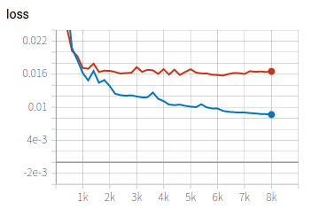

# Lung segmentation from 2D X-ray images


In this example, we use different 2D networks to segment the lung from X-Ray images. First we edit the configuration file for training and testing. During training, we use tensorboard to observe the performance of the network at different iterations. We then apply the trained model to testing images and obtain quantitative evaluation results. The following networks are implemented in this example:

|Method|Reference|Remarks|
|---|---|---|
|UNet2D|[Ronneberger et al., MICCAI 2015][unet_paper]| 2D Unet|
|CANet| [Gu et al., IEEE TMI 2021][canet_paper]| Comprehensive Attentin Network|
|COPLENet|[Wang et al., IEEE TMI 2022][coplenet_paper]| Originally for Covid-19 lesion segmentation|
|TransUNet|[Chen et al., Arxiv 2021][transuent_paper] | UNet combined with Transformer |
|SwinUNet|[Cao et al., ECCV 2022][swinunet_paper] |  UNet combined with Swin Transformer |


[unet_paper]:https://link.springer.com/chapter/10.1007/978-3-319-24574-4_28
[canet_paper]:https://doi.org/10.1109/tmi.2020.3035253
[coplenet_paper]:https://ieeexplore.ieee.org/document/9109297
[transuent_paper]:https://arxiv.org/abs/2102.04306
[swinunet_paper]:https://link.springer.com/chapter/10.1007/978-3-031-25066-8_9

## Data and preprocessing
1. The orginal dataset is available at the [JSRT website][jsrt_link]. It consists of 247 chest radiographs. We have preprocessed the images by resizing them to 256x256 and extracting the lung masks for the segmentation task. The images are available at `PyMIC_data/JSRT`. If interested, you can read `image_convert.py` for details of the preprocessing.  

5. Run `python write_csv_files.py` to randomly split the 247 images into training (180 images), validation (20 images) and testing (47 images) sets. The output csv files are saved in `config`.

[jsrt_link]:http://db.jsrt.or.jp/eng.php

## Training
1. Start to train by running:
 
```bash
pymic_train config/unet.cfg
```

2. During training or after training, run `tensorboard --logdir model/unet` and you will see a link in the output, such as `http://your-computer:6006`. Open the link in the browser and you can observe the average Dice score and loss during the training stage, such as shown in the following images, where red and blue curves are for training set and validation set respectively. We can observe some over-fitting on the training set. 




## Testing and evaluation
1. Run the following command to obtain segmentation results of testing images. By default we use the latest checkpoint. You can set `ckpt_mode` to 1 in `config/unet.cfg` to use the best performing checkpoint based on the validation set.

```bash
pymic_test config/unet.cfg
```

2. Then edit `config/evaluation.cfg` by setting `ground_truth_folder_root` as your `JSRT_root`, and run the following command to obtain quantitative evaluation results in terms of dice. 

```bash
pymic_eval_seg config/evaluation.cfg
```

The obtained average Dice score by default setting should be close to 98.068%. If setting `ckpt_mode` to 1 during testing, the average Dice would be around 98.096%. 
