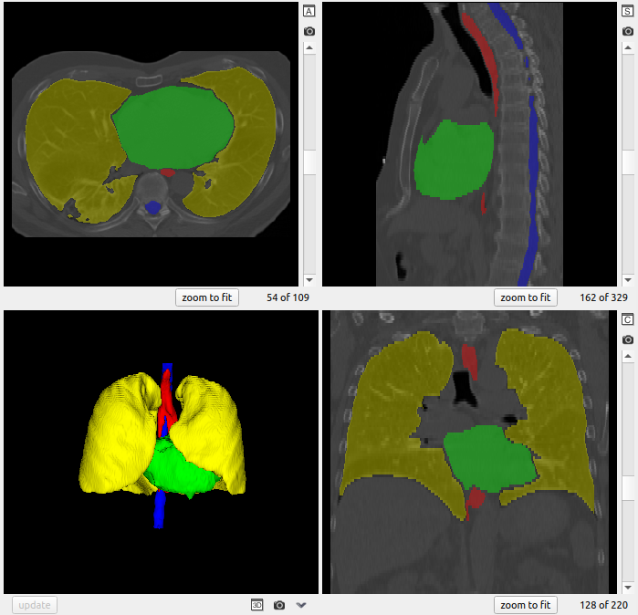

# Chest organ segmentation from 3D CTT
 

In this example, we use 3D neural networks to segment chest organs from 3D CT volumes. 
The following networks are considered:

|Network  |Reference | Remarks|
|---|---| ---|
|UNet2D5 | [Wang et al., MICCAI 2019][unet2d5_paper]|  A 2.5D UNet combining 2D and 3D convolutions|
|UNet3D |[Çiçek et al., MICCAI 2016][unet3d_paper]| 3D UNet|
|UNet3D_scse |[Roy et al., TMI 2019][scse_paper]| 3D UNe with spatial and channel attention |
|LCOVNet| [Zhao et al., TMI 2023][lcovnet_paper]| A lightweight 3D CNN|

[unet2d5_paper]:https://link.springer.com/chapter/10.1007/978-3-030-32245-8_30
[unet3d_paper]:https://link.springer.com/chapter/10.1007/978-3-319-46723-8_49
[scse_paper]:https://ieeexplore.ieee.org/document/8447284
[lcovnet_paper]:https://ieeexplore.ieee.org/document/10083150/


## Data 
1. We use the [Promise12][promise12_link] dataset for this example. The preprocessed images are available in `PyMIC_data/Promise12`. We have resampled the original images into a uniform resolution and cropped them to a smaller size. The code for preprocessing is in  `preprocess.py`.
2. Run `python write_csv_files.py` to randomly split the dataset into our own training (35 images), validation (5 images) and testing (10 images) sets. The output csv files are saved in `config/data`.

[promise12_link]:https://promise12.grand-challenge.org/

## Training
1. Start to train by running:
 
```bash
pymic_train config/unet3d.cfg
```

Note that we set `multiscale_pred = True`, `deep_supervise = True` and `loss_type = [DiceLoss, CrossEntropyLoss]` in the configure file. We also use Mixup for data
augmentation by setting `mixup_probability=0.5`.

2. During training or after training, run `tensorboard --logdir model/unet3d` and you will see a link in the output, such as `http://your-computer:6006`. Open the link in the browser and you can observe the average Dice score and loss during the training stage, such as shown in the following images, where blue and red curves are for training set and validation set respectively. 


## Testing and evaluation
1. Run the following command to obtain segmentation results of testing images. By default we set `ckpt_mode` to 1, which means using the best performing checkpoint based on the validation set.

```bash
pymic_test config/unet3d.cfg
```

2. Run the following command to obtain quantitative evaluation results in terms of Dice. 

```bash
pymic_eval_seg -cfg config/evaluation.cfg
```

The obtained average Dice score by default setting should be close to 88.04%, and the Average Symmetric Surface Distance (ASSD) is 1.41 mm. You can try your efforts to improve the performance with different networks or training strategies by changing the configuration file `config/unet3d.cfg`.

