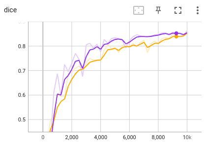
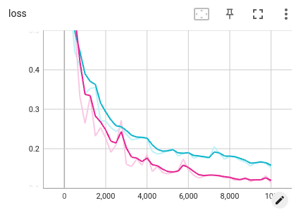

# Chest organ segmentation from 3D CTT
 

In this example, we use 3D neural networks to segment chest organs from 3D CT volumes. 
The following networks are considered:

|Network  |Reference | Remarks|
|---|---| ---|
|UNet2D5 | [Wang et al., MICCAI 2019][unet2d5_paper]|  A 2.5D UNet combining 2D and 3D convolutions|
|UNet3D |[Çiçek et al., MICCAI 2016][unet3d_paper]| 3D UNet|
|UNet3D_scse |[Roy et al., TMI 2019][scse_paper]| 3D UNe with spatial and channel attention |
|LCOVNet| [Zhao et al., TMI 2023][lcovnet_paper]| A lightweight 3D CNN|

[unet2d5_paper]:https://link.springer.com/chapter/10.1007/978-3-030-32245-8_30
[unet3d_paper]:https://link.springer.com/chapter/10.1007/978-3-319-46723-8_49
[scse_paper]:https://ieeexplore.ieee.org/document/8447284
[lcovnet_paper]:https://ieeexplore.ieee.org/document/10083150/


## 1. Data 
The [LCTSC2017][lctsc_link] dataset is used for segmentation for four organs-at-risks: the esophagus, heart, spinal cord and lung. It contains CT scans of 60 patients. We have provided a preprocessed version of LCTSC2017 and it is available at 
`PyMIC_examples/PyMIC_data/LCTSC2017`. The preprocessing was based on cropping. 

[lctsc_link]:https://wiki.cancerimagingarchive.net/pages/viewpage.action?pageId=24284539

we randomly split the dataet into  36, 9 and 27 and  for training, validation and testing, respectively. They are saved in `image_train.csv`, `image_valid.csv` and `image_test.csv` under the folder of `config`, respectively. The script for data split is `write_csv.py`.


## 2. Segmentation with UNet3D
### 2.1 Training
We first use the UNet3D for the segmentation task. The configuration file is `config/unet3d.cfg`. Some key configurations are like the following:

```bash
[dataset]
...
train_dir = ../../PyMIC_data/LCTSC2017
train_csv = config/image_train.csv
valid_csv = config/image_valid.csv
test_csv  = config/image_test.csv

...
train_batch_size = 2
patch_size       = [96, 96, 96]
train_transform  = [Pad, RandomCrop, NormalizeWithMinMax, RandomFlip, LabelToProbability]
valid_transform  = [Pad, NormalizeWithMinMax, LabelToProbability]
test_transform   = [Pad, NormalizeWithMinMax]

NormalizeWithMinMax_channels        = [0]
NormalizeWithMinMax_threshold_lower = [-1000]
NormalizeWithMinMax_threshold_upper = [1000]
...
[network]
net_type     = UNet3D
class_num    = 5
in_chns      = 1
feature_chns = [32, 64, 128, 256, 512]
dropout      = [0, 0, 0.2, 0.2, 0.2]

[training]
...
loss_type     = DiceLoss
optimizer     = Adam
learning_rate = 1e-3
momentum      = 0.9
weight_decay  = 1e-5

lr_scheduler = StepLR
lr_gamma = 0.5
lr_step  = 4000
early_stop_patience = 6000
ckpt_dir            = model/unet3d

iter_max   = 10000
iter_valid = 250
iter_save  = 10000
```

where we use random crop and flipping for data augmentation. Each batch contains 2 images, with a patch size of 96x96x96. The DiceLoss is used for training, with an Adam optimizer and an initial learning rate of 0.001. The total iteration number is 10000, and the Step learning rate scheduler is used.  Start to train by running:
 
```bash
pymic_train config/unet3d.cfg
```

During training or after training, run `tensorboard --logdir model/unet3d` and you will see a link in the output, such as `http://your-computer:6006`. Open the link in the browser and you can observe the average Dice score and loss during the training stage, such as shown in the following images, where blue and red curves are for training set and validation set respectively. 




### 2.2 Testing
The configuration for testing is in `[testing]` section of `config/unet3d.cfg`:

```bash
[testing]
gpus       = [0]

ckpt_mode         = 1
output_dir        = result/unet3d
sliding_window_enable = True
sliding_window_batch  = 4
sliding_window_size   = [96, 96, 96]
sliding_window_stride = [48, 48, 48]
```

where we use a sliding window of 96x96x96 for inference. By default we use the best validation checkpoint for inference. Run the following command for testing:

```bash
pymic_test config/unet3d.cfg
```

### 2.3 Evaluation
2. Run the following command to obtain quantitative evaluation results in terms of Dice. 

```bash
pymic_eval_seg -cfg config/evaluation.cfg
```

The obtained average Dice score by default setting should be close to 85%.

## 3. Segmentation with other networks

For the other networks, please replace `config/unet3d.cfg` by the corresponding configuration files during the training and prediction stages. See `config/***.cfg` for examples of other networks, such as UNet2D5, UNet3D_scse and LCOVNet.
