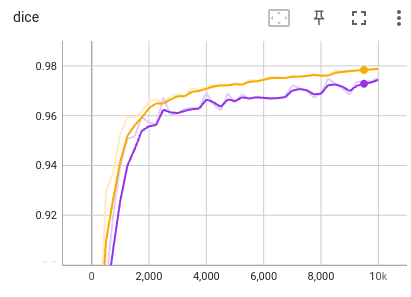
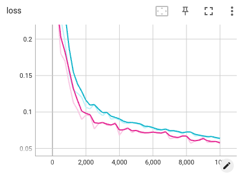

# Fetal brain segmentation from ultrasound images

 

In this example, we use 2D neural networks to segment the fetal brain from ultrasound images. During training, we use tensorboard to observe the performance of the network at different iterations. We then apply the trained model to testing images and obtain quantitative evaluation results.


## 1, Data and preprocessing
1. We use the [HC18][hc18_link] dataset for this example. The images are ready to use in `PyMIC_data/Fetal_HC`. There are 999 2D ultrasound images and their annotations in the training set.  The original annotations are contours, and we have converted them into binary masks for segmentation. (The conversion code is in `get_ground_truth.py`)
2. Run `python write_csv_files.py` to randomly split the official HC18 training set into our own training (780 images), validation (70 images) and testing (149 images) sets. The output csv files are saved in `config`.

[hc18_link]:https://hc18.grand-challenge.org/

## 2, Training and testing with UNet
1. We first use the UNet for the segmentation task. The configuration file is `config/unet.cfg`. Some key configurations are like the following:

```bash
[dataset]
...
train_dir = ../../PyMIC_data/Fetal_HC
train_csv = config/fetal_hc_train.csv
valid_csv = config/fetal_hc_valid.csv
test_csv  = config/fetal_hc_test.csv
train_batch_size = 4

# data transforms
train_transform = [Rescale, RandomCrop, RandomFlip, NormalizeWithMeanStd, LabelConvert, LabelToProbability]
valid_transform = [Rescale, NormalizeWithMeanStd, LabelConvert, LabelToProbability]
test_transform  = [Rescale, NormalizeWithMeanStd]
Rescale_output_size    = [256, 384]
RandomCrop_output_size = [224, 320]
...

[network]
net_type      = UNet2D
class_num     = 2
in_chns       = 1
feature_chns  = [16, 32, 64, 128, 256]
dropout       = [0.0,  0.0,  0.3, 0.4, 0.5]

[training]
...
loss_type     = [DiceLoss, CrossEntropyLoss]
loss_weight   = [1.0, 1.0]

# for optimizers
optimizer     = Adam
learning_rate = 1e-3
momentum      = 0.9
weight_decay  = 1e-5

# for lr schedular  
lr_scheduler = PolynomialLR
lr_power     = 0.8
early_stop_patience = 5000
ckpt_dir    = model/unet2d

iter_max   = 10000
iter_valid = 250
iter_save  = 10000
...
```

where we use random rescale, random crop and flipping for data augmentation. The patch size of 224x320. Each batch contains 4 images. The DiceLoss and CrossEntropyLoss are used for training, with an Adam optimizer and an initial learning rate of 0.001. The total iteration number is 10000, and the Polynomial learning rate schedular is used.  Start to train by running:
 
```bash
pymic_train config/unet.cfg
```

During training or after training, run `tensorboard --logdir model/unet` and you will see a link in the output, such as `http://your-computer:6006`. Open the link in the browser and you can observe the average Dice score and loss during the training stage, such as shown in the following images.  In the left one, the yellow and purple curves are for training and validation Dice,  respectively.  In the right one, the cyan and red curves are for training and validation loss,  respectively. 




2. Run the following command to obtain segmentation results of testing images based on the best-performing checkpoint on the validation set. By default we use sliding window inference to get better results. You can also edit the `testing` section of `config/unet.cfg` to use other inference strategies.

```bash
pymic_test config/unet.cfg
```

3. Use the following command to obtain quantitative evaluation results in terms of Dice. 

```bash
pymic_eval_seg -cfg config/evaluation.cfg
```

The obtained average Dice score by default setting should be close to 97.02%. The Average Symmetric Surface Distance (ASSD) is also calculated. 

4. Set `tta_mode = 1` in `config/unet.cfg` to enable test time augmentation, and run the testing and evaluation code again, we find that the average Dice will be increased to around 97.22%.


## 3, Using other networks

For the other networks, please replace `config/unet.cfg` by the corresponding configuration files during the training and prediction stages. See `config/***.cfg` for examples of other networks, such as CANet, COPLENet, UNet++, TransUNet and SwinUNet.

