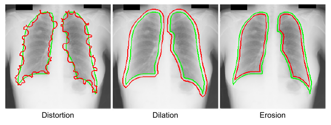

# Noisy label-based segmentation demo using PyMIC

In this example, we show noisy label learning methods implemented in PyMIC.
Currently, the following methods are available in PyMIC:
|PyMIC Method|Reference|Remarks|
|---|---|---|
|GCELoss|[Zhang et al.][gce_paper], NeurIPS 2018| Train with SegmentationAgent|
|NRDiceLoss| [Wang et al.][nrdice_paper], TMI 2020| Train with SegmentationAgent|
|MAELoss| [Kim et al.][mae_paper], AAAI 2017| Train with SegmentationAgent|
|NLLCoTeaching| [Han et al.][cot_paper], NeurIPS 2018| Co-teaching between two networks|
|NLLCLSLSR| [Zhang et al.][cl_paper], MICCAI 2020| Confident learning with spatial label smoothing|
|NLLTriNet| [Zhang et al.][trinet_paper], MICCAI 2020| Tri-network combined with sample selection|
|NLLDAST| [Yang et al.][dast_paper], JBHI 2022| Divergence-aware selective training|

[gce_paper]:https://arxiv.org/abs/1805.07836
[nrdice_paper]:https://ieeexplore.ieee.org/document/9109297
[mae_paper]:https://arxiv.org/abs/1712.09482v1  
[cot_paper]:https://arxiv.org/abs/1804.06872
[cl_paper]:https://link.springer.com/chapter/10.1007/978-3-030-59710-8_70 
[trinet_paper]:https://link.springer.com/chapter/10.1007/978-3-030-59719-1_25 
[dast_paper]:https://ieeexplore.ieee.org/document/9770406 


## Data 
The [JSRT][jsrt_link] dataset is used in this demo. It consists of 247 chest radiographs. We have preprocessed the images by resizing them to 256x256 and extracting the lung masks for the segmentation task. The images are available at `PyMIC_data/JSRT`. The images are split into 180, 20 and 47 for training, validation and testing, respectively. 

[jsrt_link]:http://db.jsrt.or.jp/eng.php

For training images, we simulate noisy labels for 171 images (95%) and keep the clean label for 9 (5%) images. Run `python noise_simulate.py` to generate niosy labels based on dilation, erosion and edge distortion. The output noisy labels are saved in `PyMIC_data/JSRT/label_noise1`. The following figure shows simulated noisy labels compared with the ground truth clean label. The .csv files for data split are saved in `config/data`.




## Training
In this demo, we experiment with five methods: GCE loss, co-teaching, Trinet and DAST, and the baseline of learning with a cross entropy loss. All these methods use UNet2D as the backbone network.

### Baseline Method
The dataset setting is similar to that in the `segmentation/JSRT` demo. See `config/unet2d_ce.cfg` for details. Here we use a slightly different setting of data and loss function:

```bash
...
tensor_type    = float
task_type      = seg
supervise_type = fully_sup

train_dir = ../../PyMIC_data/JSRT
train_csv = config/data/jsrt_train_mix.csv
valid_csv = config/data/jsrt_valid.csv
test_csv  = config/data/jsrt_test.csv
...
loss_type     = CrossEntropyLoss
```

The following commands are used for training and inference with this method, respectively:

```bash
pymic_train config/unet_ce.cfg
pymic_test config/unet_ce.cfg
```

### GCE Loss
The configuration file for using GCE loss is `config/unet2d_gce.cfg`.  The  configuration is the same as that in the baseline except for the loss function:

```bash
...
loss_type     = GeneralizedCELoss
...
```

The following commands are used for training and inference with this method, respectively:

```bash
pymic_train config/unet_gce.cfg
pymic_test config/unet_gce.cfg
```

### CLSLSR
The CLSLSR method estimates errors in the original noisy label and obtains pixel-level weight maps based on an intial model, and then uses the weight maps to suppress noises in  a standard supervised learning procedure. Assume that the initial model is the baseline method, run the following command to obtain the weight maps:

```bash
python clslsr_get_condience.py config/unet_ce.cfg
```

The weight maps will be saved in `$root_dir/slsr_conf`. Then train the new model and do inference by:

```bash
pymic_train config/unet_clslsr.cfg
pymic_test config/unet_clslsr.cfg
```

Note that the weight maps for training images are specified in the configuration file `train_csv = config/data/jsrt_train_mix_clslsr.csv`.

### Co-Teaching
The configuration file for Co-Teaching is `config/unet2d_cot.cfg`. Note that for the following methods, `supervise_type` should be set to  `noisy_label`.

```bash
[dataset]
...
supervise_type = noisy_label
...

[noisy_label_learning]
method_name  = CoTeaching
co_teaching_select_ratio  = 0.8  
rampup_start = 1000
rampup_end   = 8000
```

The following commands are used for training and inference with this method, respectively:
```bash
pymic_train config/unet_cot.cfg
pymic_test config/unet_cot.cfg
```

### TriNet
The configuration file for TriNet is `config/unet_trinet.cfg`. The corresponding setting is:

```bash 
[dataset]
...
supervise_type = noisy_label
...

[noisy_label_learning]
method_name  = TriNet
trinet_select_ratio = 0.9
rampup_start = 1000
rampup_end   = 8000
```

The following commands are used for training and inference with this method, respectively:

```bash
pymic_train config/unet_trinet.cfg
pymic_test config/unet_trinet.cfg
```

### DAST
The configuration file for DAST is `config/unet_dast.cfg`. The corresponding setting is:

```bash
[dataset]
...
supervise_type = noisy_label
...

[noisy_label_learning]
method_name  = DAST
dast_dbc_w   = 0.1
dast_st_w    = 0.1  
dast_rank_length  = 20
dast_select_ratio = 0.2
rampup_start = 1000
rampup_end   = 8000
```

The commands for training and inference are:

```bash
pymic_train config/unet_dast.cfg
pymic_test config/unet_dast.cfg
```

## Evaluation
Use `pymic_eval_seg config/evaluation.cfg` for quantitative evaluation of the segmentation results. You need to edit `config/evaluation.cfg` first, for example:

```bash
metric_list = [dice, assd]
label_list = [255]
organ_name = lung

ground_truth_folder = ../../PyMIC_data/JSRT
segmentation_folder = result/unet_ce
evaluation_image_pair     = config/data/jsrt_test_gt_seg.csv
```

