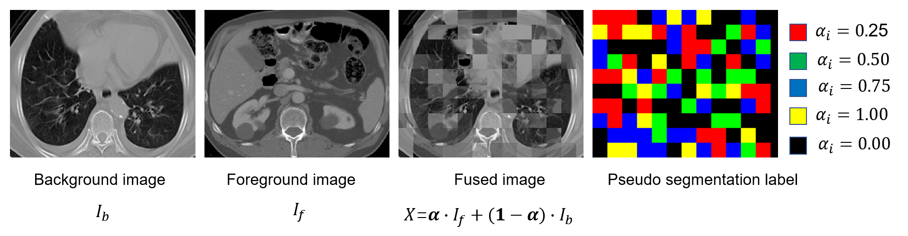

# Self-supervised segmentation using PyMIC

In this example, we show self-supervised training methods for segmentation implemented in PyMIC.
Currently, the following self-supervised methods are implemented:
|Method name |PyMIC class |Reference|
|---|---|---|
|VolF |SelfSupVolumeFusion| [Wang et al., Arxiv 2023][vf_paper]|
|ModelGenesis |SelfSupModelGenesis| [Zhou et al., MIA 2021][mg_paper]|
|PatchSwapping|SelfSupPatchSwapping| [Chen et al., MIA 2019][ps_paper]| 
|Vox2vec |SelfSupVox2Vec|  [Goncharov et al., MICCAI 2023][vox2vec_paper]|

[vf_paper]:https://arxiv.org/abs/2306.16925
[mg_paper]:https://www.sciencedirect.com/science/article/pii/S1361841520302048
[ps_paper]:https://www.sciencedirect.com/science/article/pii/S1361841518304699
[vox2vec_paper]:https://link.springer.com/chapter/10.1007/978-3-031-43907-0_58

The following figure shows a performance comparison between training from scratch and with Volume Fusion (VolF)-bsed pretraining. It can be observed that the pretraining largely improves the convergence of the model and leads to a better final performance.


## 1. Data 
The LUNA dataset is used for self-supervised pretraining. It contains 888 CT volumes of patients with lung nodule. The [LCTSC2017][lctsc_link] dataset is used for downstream segmentation for four organs-at-risks: the esophagus, heart, spinal cord and lung. LCTSC2017 contains CT scans of 60 patients. Please downlaod the LUNA dataset from the [zenodo][luna_link] website. We have provided a preprocessed version of LCTSC2017 and it is available at 
`PyMIC_examples/PyMIC_data/LCTSC2017`. The preprocessing was based on cropping. 

[luna_link]:https://zenodo.org/records/3723295
[lctsc_link]:https://wiki.cancerimagingarchive.net/pages/viewpage.action?pageId=24284539

### 1.1. Preprocessing for LUNA dataset
The LUNA dataset contrains 10 subfolders. We use folder 0-8 for training and 9 for validation during self-supervised learning.  As the orignal CT volumes have a large size, and to speedup the data loading process, we preprocess the LUNA dataset by cropping each volume to smaller subvolumes. In addition, the intensity is clipped to [-1000, 1000] and then normalized to [-1, 1]. Do the preprocessing by running:

```bash
python luna_preprocess.py
```

Note that you need to set the correct input and output folders for runing the script. After preprocessing, we create csv files for training and validation images by running:

```bash
python get_luna_csv.py
```

Note that the path of folder containing the preprocessed LUNA dataset should be correctly set in the script. Then we obtain two csv files: `config/luna_data/luna_train.csv` and `config/luna_data/luna_valid.csv`, and they are for training and validaiton images, respectively.

## 2. Pretraining with VolF
### 2.1. Pretraining
For VolF, we need to  create a validation dataset that contains fused volumes and the ground truth for the pretext task, i.e., a pseudo-segmentation task. Do this by runing the following command:

```bash
pymic_preprocess config/luna_data/preprocess_volumefusion.cfg
```

The parameters for volume fusion are:

```bash
transform = [Crop4VolumeFusion, VolumeFusion]
Crop4VolumeFusion_output_size = [64, 128, 128]
VolumeFusion_cls_num = 5
VolumeFusion_foreground_ratio = 0.7
VolumeFusion_patchsize_min    = [5, 8, 8]
VolumeFusion_patchsize_max    = [20, 32, 32]
```

where we generate 5 classes of voxels (including the background), and the block size ranges from [5, 8, 8] and [20, 32, 32]. The probability of a block being set as foreground is 0.7. The generated validation set for volume fusion is saved in `./pretrain_valid/volumefusion`. Blow is an example of the fused volume and the ground truth for the pseudo-segmentation task:



Then we use `VolumeFusion` to pretrain a 3D UNet, run the following command:

```bash
pymic_train config/luna_pretrain/unet3d_volumefusion.cfg
```

The pretraining is just an image segmentation task, and the configurations related to the pretraining process is:

```bash
[dataset]
...
train_transform = [Crop4VolumeFusion, VolumeFusion, LabelToProbability]
valid_transform = [CenterCrop, LabelToProbability]
test_transform  = None

Crop4VolumeFusion_output_size = [64, 128, 128]
VolumeFusion_cls_num = 5
VolumeFusion_foreground_ratio = 0.7
VolumeFusion_patchsize_min    = [5, 8, 8]
VolumeFusion_patchsize_max    = [20, 32, 32]

[self_supervised_learning]
method_name = VolumeFusion


[training]
# list of gpus
gpus       = [0]


loss_type     = [DiceLoss, CrossEntropyLoss]
loss_weight   = [0.5, 0.5]

# for optimizers
optimizer     = Adam
learning_rate = 1e-3
momentum      = 0.9
weight_decay  = 1e-5

# for lr schedular
lr_scheduler = StepLR
lr_gamma = 0.5
lr_step  = 20000
early_stop_patience = 60000
ckpt_save_dir       = pretrain_model/unet3d_volf

iter_max   = 80000
iter_valid = 1000
iter_save  = 40000
```

### 2.2. Downstream segmentation with LCTSC2017 dataset
Based on the pretrained model, we use it to intialize the 3D UNet for the downstream segmentation task on the LCTSC2017 dataset.

First, make sure that you have downloaded  the preprocessed LCTSC2017 dataset and put it in `PyMIC_examples/PyMIC_data/LCTSC2017`, as mentioned above. As the 60 CT volumes have 24 for testing, we randomly split the other 36 into 27 for training and 9 for validation. Run the following command to do the data split and writing the csv files:

```bash
python write_csv.py
```

Then run the following command to train the segmentation model with the pretrained weights:
```bash
pymic_train config/lctsc_train/unet3d_volf.cfg
``` 

The relevant configuration is:
```bash
train_dir = ../../PyMIC_data/LCTSC2017
train_csv = config/data_lctsc/image_train.csv
valid_csv = config/data_lctsc/image_valid.csv
test_csv  = config/data_lctsc/image_test.csv

[network]
# type of network
net_type = UNet3D

# number of class, required for segmentation task
class_num = 5

in_chns       = 1
feature_chns  = [32, 64, 128, 256, 512]
dropout       = [0, 0, 0.2, 0.2, 0.2]
up_mode       = 2
multiscale_pred = False


[training]
# list of gpus
gpus       = [0]

loss_type     = [DiceLoss, CrossEntropyLoss]
loss_weight   = [0.5, 0.5]

# for optimizers
optimizer     = Adam
learning_rate = 1e-3
momentum      = 0.9
weight_decay  = 1e-5


# for lr schedular (StepLR)
lr_scheduler = StepLR
lr_gamma = 0.5
lr_step  = 4000
early_stop_patience = 6000
ckpt_save_dir       = lctsc_model/unet3d_volf
ckpt_init_name      = ../../pretrain_model/unet3d_volf/unet3d_volf_best.pt
ckpt_init_mode      = 0
``` 

The performance on the training and validation set during the first 1000 iterations would be like:

```bash
2024-01-05 22:43:58 it 200
learning rate 0.001
training/validation time: 63.95s/33.70s
train loss 0.4338, avg foreground dice 0.4221 [0.9144 0.0204 0.5661 0.1734 0.9285]
valid loss 0.2120, avg foreground dice 0.6257 [0.9828 0.0000 0.7991 0.7334 0.9704]

2024-01-05 22:45:36 it 400
learning rate 0.001
training/validation time: 63.56s/33.61s
train loss 0.2369, avg foreground dice 0.6609 [0.9559 0.2293 0.8100 0.6426 0.9618]
valid loss 0.1572, avg foreground dice 0.7423 [0.9827 0.3464 0.8199 0.8314 0.9715]

2024-01-05 22:47:15 it 600
learning rate 0.001
training/validation time: 63.28s/33.66s
train loss 0.1964, avg foreground dice 0.7342 [0.9611 0.4172 0.8446 0.7091 0.9660]
valid loss 0.1158, avg foreground dice 0.8026 [0.9881 0.5026 0.8747 0.8601 0.9729]

2024-01-05 22:48:53 it 800
learning rate 0.001
training/validation time: 62.19s/33.60s
train loss 0.1777, avg foreground dice 0.7631 [0.9667 0.4951 0.8750 0.7122 0.9700]
valid loss 0.1041, avg foreground dice 0.8248 [0.9890 0.5737 0.8847 0.8657 0.9752]

2024-01-05 22:50:33 it 1000
learning rate 0.001
training/validation time: 63.72s/34.05s
train loss 0.1744, avg foreground dice 0.7713 [0.9663 0.5360 0.8693 0.7104 0.9693]
valid loss 0.1217, avg foreground dice 0.7994 [0.9859 0.5184 0.8499 0.8627 0.9667]
```

It can be observed that after 1000 iterations, the average foreground Dice on the validation set reaches 0.7994.

### 2.3 Comparison with training from scatch
For comparison, we also train 3D UNet for the downstream segmentatin task from scratch, run the following command:

```bash
pymic_train config/lctsc_train/unet3d_scratch.cfg
``` 

The performance on the training and validation set during the first 1000 iterations would be like:

```bash
2024-01-05 21:51:58 it 200
learning rate 0.001
training/validation time: 63.13s/32.00s
train loss 0.5676, avg foreground dice 0.3941 [0.8745 0.0652 0.4574 0.1555 0.8981]
valid loss 0.4571, avg foreground dice 0.3210 [0.9221 0.0000 0.3579 0.0000 0.9263]

2024-01-05 21:53:31 it 400
learning rate 0.001
training/validation time: 60.62s/32.27s
train loss 0.4227, avg foreground dice 0.4294 [0.9149 0.0500 0.5838 0.1450 0.9389]
valid loss 0.4203, avg foreground dice 0.3470 [0.9263 0.0000 0.5348 0.0000 0.8534]

2024-01-05 21:55:08 it 600
learning rate 0.001
training/validation time: 61.73s/32.33s
train loss 0.3926, avg foreground dice 0.4511 [0.9256 0.0550 0.6557 0.1500 0.9437]
valid loss 0.4006, avg foreground dice 0.3739 [0.9413 0.0000 0.6263 0.0000 0.8694]

2024-01-05 21:56:43 it 800
learning rate 0.001
training/validation time: 60.51s/32.34s
train loss 0.3571, avg foreground dice 0.4938 [0.9311 0.0650 0.6926 0.2678 0.9498]
valid loss 0.4259, avg foreground dice 0.4724 [0.9290 0.0000 0.6742 0.3995 0.8161]

2024-01-05 21:58:19 it 1000
learning rate 0.001
training/validation time: 61.42s/32.38s
train loss 0.3271, avg foreground dice 0.5411 [0.9352 0.0950 0.7140 0.4034 0.9520]
valid loss 0.2957, avg foreground dice 0.5071 [0.9610 0.0000 0.6950 0.4240 0.9093]
```

It can be observed that the performance during the first 1000 iteration is much lower than that with pretraining. You can also observe the curves of Dice and loss during training using tensorboard:
```bash
tensorboard --logdir=./lctsc_model
```

Then we do the inference with the trained models respectively:
```bash
pymic_test config/lctsc_train/unet3d_volf.cfg
pymic_test config/lctsc_train/unet3d_scratch.cfg
``` 

The predictions are saved in `./lctsc_result/unet3d_volf` and `./lctsc_result/unet3d_scratch`, respectively. To obtain the quantitative evaluaiton scores in terms of Dice, run:

```bash
pymic_eval_seg -cfg config/evaluation.cfg
``` 

Note that we do not use any post-processing methods. The average Dice (%) for each class obtained by the two models will be like:
|Method |Esophagus |Heart |Spinal cord |Lung |Average |
|---|---|---|---|---|---|
|From Scratch               | 68.89 | 89.86 | 85.50 | 97.23 | 85.37 |
|Pretrain with VolF| 73.38 | 91.61 | 86.20 | 97.35 | 87.14 |

## 3. Using other self-supervised pretraining methods
In addition to VolF, you can also try other self-supervised pretraining methods including ModelGenesis, PatchSwapping and Vox2vec.
### 3.1. Pretraining with Model Genesis
Similarly to VolF, we need to  create a validation dataset that contains corrupted input images and the ground truth for the pretext task, i.e., image reconstruction task. Do this by runing the following command:

```bash
pymic_preprocess config/luna_data/preprocess_genesis.cfg
```

The generated validation set for model genesis is saved in `./pretrain_valid/genesis`.
Then we use `ModelGenesis` to pretrain a 3D UNet, run the following command:

```bash
pymic_train config/luna_pretrain/unet3d_genesis.cfg
```

Finally, we initialize 3D UNet with the pretrained weights for downstream segmentation:
```bash
pymic_train config/lctsc_train/unet3d_genesis.cfg
``` 

### 3.2 Pretraining with Patch Swapping
Firstly, we also create a validation dataset that contains patch-swapped input images and the ground truth for the pretext task, i.e., image reconstruction task. Do this by runing the following command:

```bash
pymic_preprocess config/luna_data/preprocess_patchswap.cfg
```

The generated validation set for patch swapping is saved in `./pretrain_valid/patchswap`.
Then we use `PatchSwapping` to pretrain a 3D UNet, run the following command:

```bash
pymic_train config/luna_pretrain/unet3d_patchswap.cfg
```

Finally, we initialize 3D UNet with the pretrained weights for downstream segmentation:
```bash
pymic_train config/lctsc_train/unet3d_patchswap.cfg
``` 

### 3.3 Pretraining with Vox2vec
See `./config/luna_pretrain/unet3d_vox2vec.cfg` for detailed configuration of Vox2vec. Note that this method requires a pair of overlapped cropping for contrastive learning. The corresponding setting is:

```bash
train_transform = [Crop4Vox2Vec]
Crop4Vox2Vec_output_size = [64, 128, 128]
Crop4Vox2Vec_min_overlap = [48, 96, 96]
```

The following command is used for pretraining:

```bash
pymic_train config/luna_pretrain/unet3d_vox2vec.cfg
```

Then, initialize 3D UNet with the pretrained weights for downstream segmentation:

```bash
pymic_train config/lctsc_train/unet3d_vox2vec.cfg
``` 