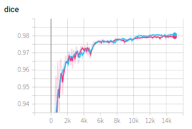
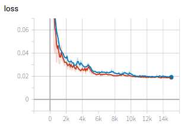

# Fetal brain segmentation from ultrasound images

 

In this example, we use 2D U-Net to segment the fetal brain from ultrasound images. First we download the images from internet, then edit the configuration file for training and testing. During training, we use tensorboard to observe the performance of the network at different iterations. We then apply the trained model to testing images and obtain quantitative evaluation results.


## Data and preprocessing
1. We use the `HC18` dataset for this example. The images are available from the [website][hc18_link]. Download the HC18 training set that consists of 999 2D ultrasound images and their annotations. Create a new folder as `HC_root`, and download the images and save them in a sub-folder, like `HC_root/training_set`. 
2. The annotation of this dataset are contours. We need to convert them into binary masks for segmentation. Therefore, create a folder `HC_root/training_set_label` for preprocessing.
4. Set `HC_root` according to your computer in `get_ground_truth.py` and run `python get_ground_truth.py` for preprocessing. This command converts the contours into binary masks for brain, and the masks are saved in `HC_root/training_set_label`.
5. Set `HC_root` according to your computer in `write_csv_files.py` and run `python write_csv_files.py` to randomly split the official HC18 training set into our own training (780 images), validation (70 images) and testing (149 images) sets. The output csv files are saved in `config`.

[hc18_link]:https://hc18.grand-challenge.org/

## Training
1. Edit `config/train_test.cfg` by setting the value of `root_dir` as your `HC_root`. Then start to train by running:
 
```bash
pymic_net_run train config/train_test.cfg
```

2. During training or after training, run `tensorboard --logdir model/unet` and you will see a link in the output, such as `http://your-computer:6006`. Open the link in the browser and you can observe the average Dice score and loss during the training stage, such as shown in the following images, where red and blue curves are for training set and validation set respectively. 




## Testing and evaluation
1. Run the following command to obtain segmentation results of testing images based on the best-performing checkpoint on the validation set. By default we use sliding window inference to get better results. You can also edit the `testing` section of `config/train_test.cfg` to use other inference strategies.

```bash
mkdir result
pymic_net_run test config/train_test.cfg
```

2. Then edit `config/evaluation.cfg` by setting `ground_truth_folder_root` as your `HC_root`, and run the following command to obtain quantitative evaluation results in terms of Dice. 

```bash
pymic_evaluate_seg config/evaluation.cfg
```

The obtained average Dice score by default setting should be close to 97.10%. You can set `metric = assd` in `config/evaluation.cfg` and run the evaluation command again to get Average Symmetric Surface Distance (ASSD) evaluation results. 

3. Set `tta_mode = 1` in `config/train_test.cfg` to enable test time augmentation, and run the testing and evaluation code again, we find that the average Dice will be increased to around 97.22%.
